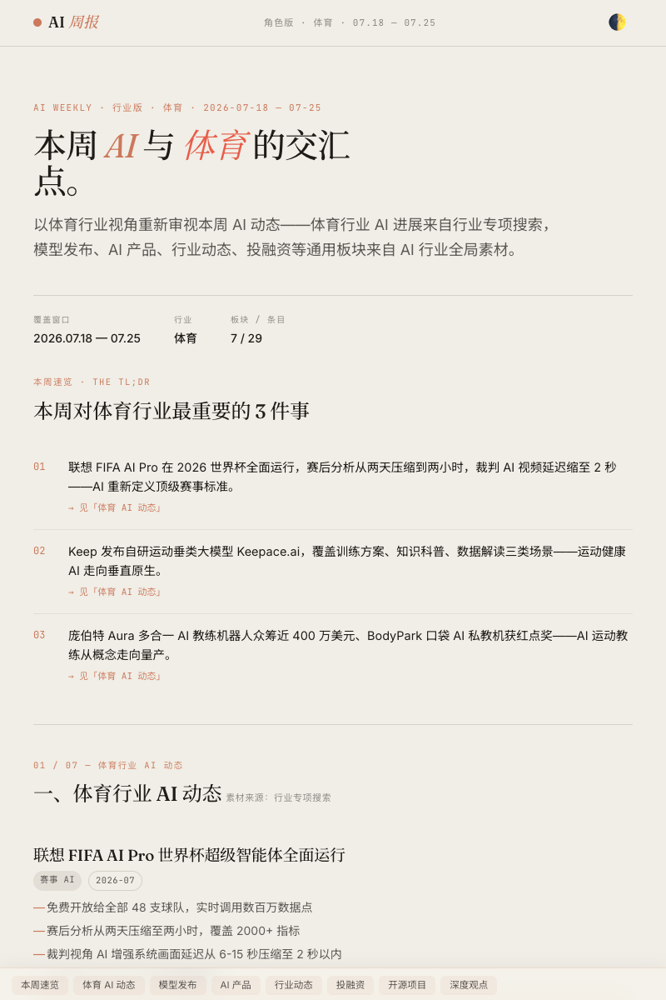
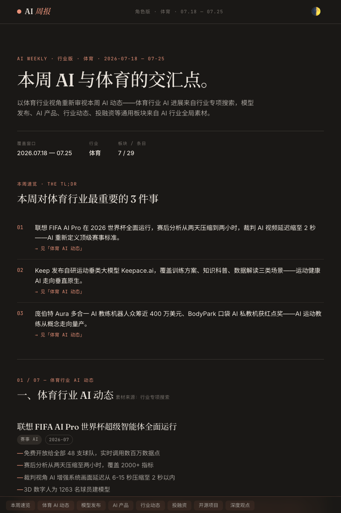

# AI Persona Weekly Digest

一个按读者角色定制 AI 周报的 Skill。同一批 8 类 AI 资讯素材池，按角色筛选、加权、改写，一次搜索产出多份定制版周报。

| 亮色模式 | 暗色模式 |
|----------|----------|
|  |  |

## 支持的角色

| 角色 | 定位 | 输出风格 |
|------|------|---------|
| **产品经理** | 提炼交互设计、商业化打法、增长启示 | 3 个主题分节 |
| **技术研发** | 关注架构、基准、部署门槛 | 模型/论文/开源分节 |
| **AI 小白** | 大白话说明本周变化，"跟我有什么关系" | 简单口语化结构 |
| **行业从业者** | 聚焦具体行业，叠加专项搜索 | 行业动态 + 通用板块（模型/AI 产品/投融资等） |

每个版本同时产出 Markdown 源稿和独立 HTML 页面，支持亮暗主题切换，移动端粘性导览。

## 设计原则

- **搜一遍，裁多份**：8 类 × 中英双语 WebSearch 一次完成，角色定制不重复搜索
- **行业记忆**：`references/industries.md` 记录每个行业的关键词和关注公司，下次直接复用
- **信源可追溯**：优先一手来源，每条标注原始链接，排除公关稿和 SEO 垃圾站
- **质量下限**：每个通用板块 ≥4 条，行业专项 ≥6-7 条
- **跨平台兼容**：决策弹窗用平台原生交互组件，不支持时回退纯文字

## 安装

### 方式一：让 AI 帮你装（推荐）

把下面这行发给任意支持 Skill 的工具，AI 会自动下载并放到正确位置：

```
请将 https://github.com/ericffu/ai-persona-weekly-digest 安装为 ai-persona-digest skill。
```

适用于 Claude Code、WorkBuddy、Trae、Cursor、Codex 等——工具会自动识别正确的安装目录。

### 方式二：手动安装

```bash
git clone https://github.com/ericffu/ai-persona-weekly-digest.git
```

然后根据工具复制到对应目录：

| 产品 | 项目级安装 | 全局安装 |
|------|-----------|---------|
| **Claude Code** | `.claude/skills/ai-persona-digest/` | `~/.claude/skills/ai-persona-digest/` |
| **WorkBuddy** | `.workbuddy/skills/ai-persona-digest/` | `~/.workbuddy/skills/ai-persona-digest/` |
| **Trae** | `.trae/skills/ai-persona-digest/` | `~/.trae/skills/ai-persona-digest/` |
| **Cursor** | `.cursor/skills/ai-persona-digest/` | `~/.cursor/skills/ai-persona-digest/` |
| **Codex** | `.codex/skills/ai-persona-digest/` | `~/.codex/skills/ai-persona-digest/` |
| **通用** | `.agents/skills/ai-persona-digest/` | 多数工具会自动发现 `.agents/skills/` |

> 不知道怎么装？直接把 `SKILL.md` 的内容贴到对话里，效果一样——只是每次新对话需要重新贴。

### 使用

安装后在对话中说：

```
帮我生成一份产品经理版 AI 周报。
帮我生成一份金融行业的 AI 周报。
```

详细流程与输出规则见 [SKILL.md](SKILL.md)。
